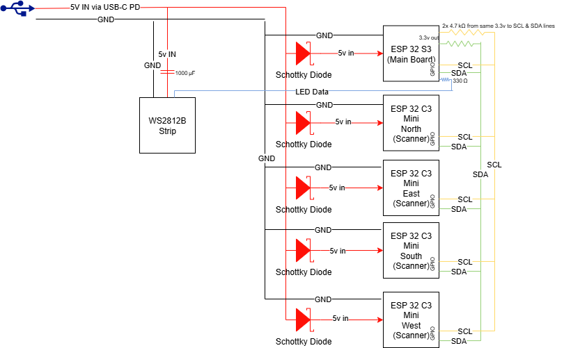

# Hardware & Wiring Notes

The hardware used in this project may not be the best or most cost effective option. This hardware was used because this was designed last minute and parts needed to come fast. Please do your own research.

## Topology
- **Sensors:** 4× Seeed XIAO ESP32‑C3 with directional panel antennas mounted ~90° apart around the hardhat.
- **Controller:** ESP32‑S3 running WLED + `UsermodI2CDirectionV2` (ID 151).
- **LEDs (rim):** WS2812b 41‑pixel ring (logical). Front = LED #20 (1‑based).
- **LEDs (mohawk):** Separate 15‑LED WS2812b strip on top. Configured as a second WLED segment with its own idle animation (not controlled by the usermod).

## I²C Bus
- **Voltage:** 3.3 V.
- **Pull‑ups:** 4.7 kΩ to 3.3 V on SDA/SCL.
- **Pins (S3):** `SDA = 4`, `SCL = 5`. **Clock = 100 kHz**.
- **Addresses (C3 scanners):** `0x10=W`, `0x11=S`, `0x12=E`, `0x13=N`.

## LED Mapping
- The usermod’s ring overlay uses `HELMET_LEN = 41`, `FRONT_LED_1BASED = 20`, `MARKER_WIDTH_PX = 5`.
- Angle (CW from front) to LED index via a small piecewise function (`angleToLocalIdx41`) tuned to your physical mounting.
- **Overlay only draws** when the active WLED segment length equals 41 (to avoid mis‑mapping). Configure this in the usermod if necessary.

## Power
- Tested with a 10,000 mAh USB-C PD pack. >8 hours runtime under actual usage.
- Tips:
  - Avoid tying multiple 5 V rails together.
  - Cap max brightness to stay within current limits. This can be done within the WLED UI.
  - Some PD banks idle‑sleep. A periodic load or higher idle draw may be required. You can increase LED brightness of the idle animation if you need a higher load.

## Antennas & Cables
- I used straight pigtails but I recommend using right-angle pigtails in the future for strain relief and cleaner routing. The shorter the pigtail, the better.
- High gain 2.4 GHz antennas with a 60-90° pattern are recommended to get a greater signal strength difference between antennas.

## Reference Wiring Diagram

**Notes on wiring diagram**  
- 5V from USB‑C PD (I recommend adding voltage and overcurrent protection here. I did not.)
- Please double-check the voltage coming out of the USB-C PD trigger. The dipswitch charts from the manufacturer are not always accurate. My multimeter was dead and I found this out the hard way by sending 15v to a 5v board. :)
- Put some hot glue over the dipswitches once you find the 5v configuration to prevent bumping the trigger to a higher voltage.
- **1000 µF** bulk cap at the LED strip input.  
- **Schottky diode** inline on 5V input to each ESP32 board (reverse-polarity protection). This helps if you'd like to debug over USB while it is running off of the USB-C PD trigger.
- **LED Data** line from S3 to LED ring with a **series resistor (330 ohm)** near the S3. I didn't actually include this, but you probably should.
- **I²C bus** at 3.3 V with **2× 4.7 kΩ pull‑ups** to 3.3 V (shared SDA/SCL to all scanners).
